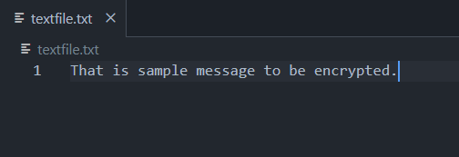
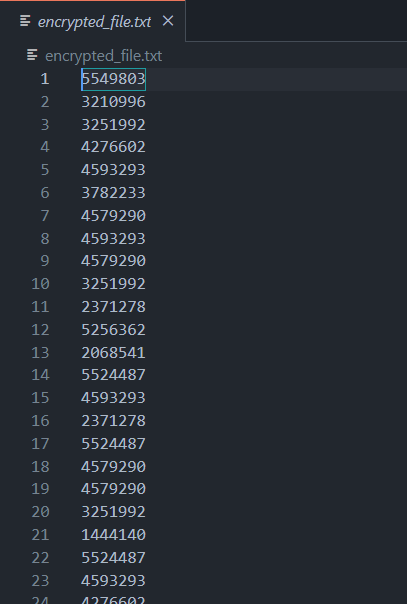
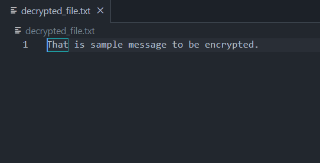

## Simple RSA file encryption project

### Goal of the project is to:
- Deeply understand how RSA works
- Understand more about assymetric keys
- Practice python
- Test algorithm to encrypt files

### Plain text:

### Encrypted file:

### Decrypted file:

# TODO
- [x] Understand RSA/assymetric keys
- [x] Write simple RSA algorithm
- [x] Check file encryption/decryption
- [ ] Improve algorithm